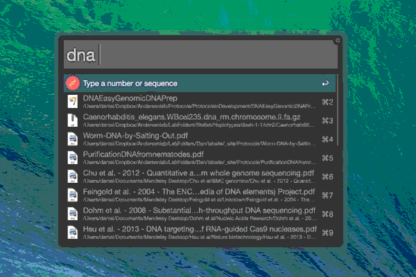

# seq-utilities 

An Alfred workflow with several useful bioinformatic/sequence utilities.

#### [Download](https://github.com/danielecook/seq-utilities/raw/workflow/Seq-Utilities.alfredworkflow)

## Usage

__Generate a random dna sequence 200 base pairs long.__

	dna 200

__Generate the complement, reverse complement, RNA, and protein of a DNA sequence__

	dna ATGTCCTCGTTCGACCGTCGTATTGAAGCTGCATGTAAA
	
__Open up blast and pre-populate the search field__

	blast ATGTCCTCGTTCGACCGTCGTATTGAAGCTGCATGTAAA

